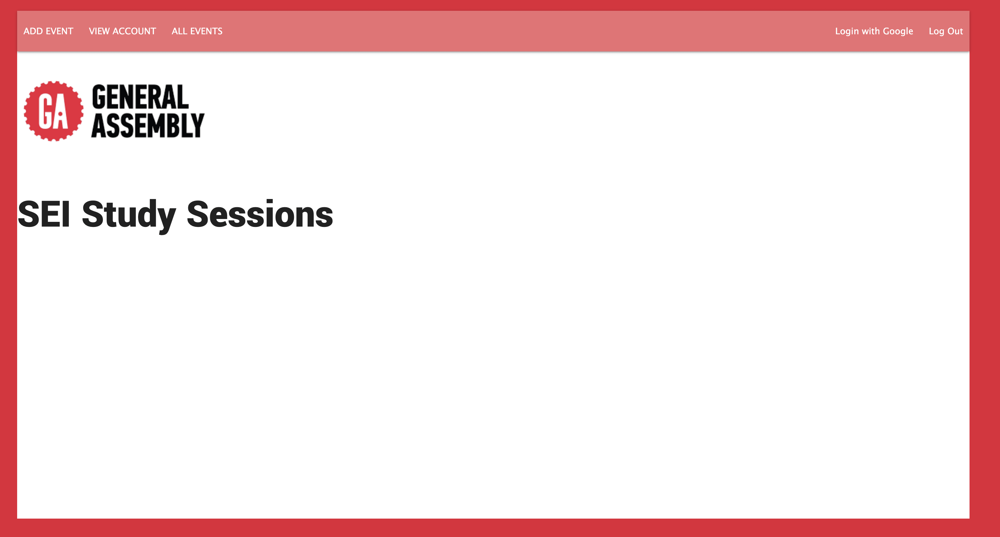
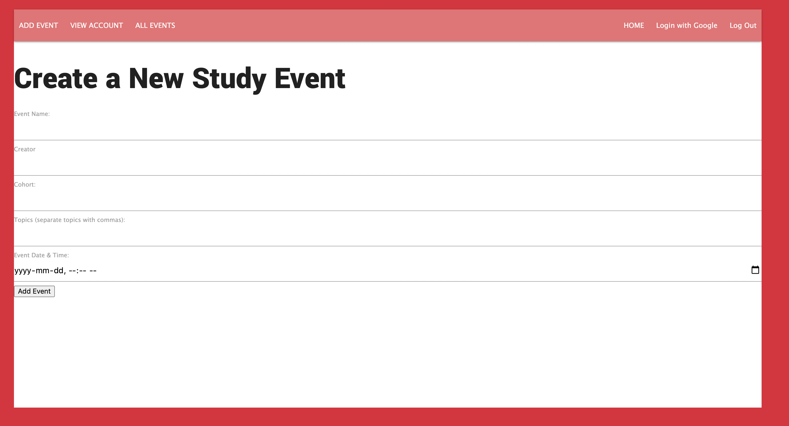
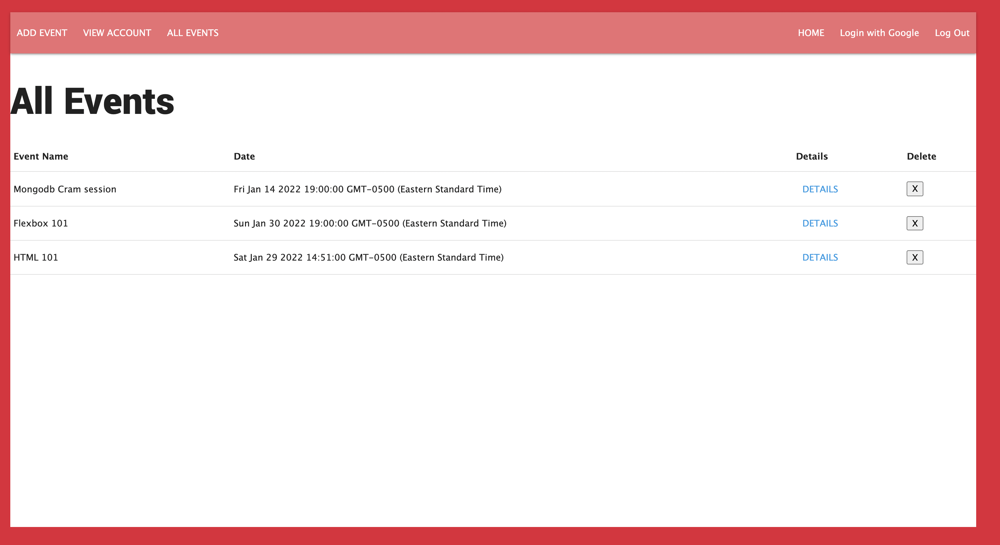
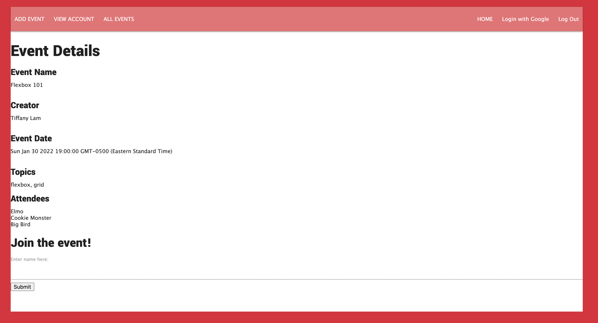

## ** ReadMe for SEI Study Sessions**

## SEI study sessions was created to allow for students enrolled in the General Assembly software engineering program to collaborate and study together.

## Technologies Used
* NodeJS
* Express
* mongoDB
* mongoose
* javascript
* HTML
* CSS

## Getting Started
1. Access the project from the link below:
https://sei-study-sessions.herokuapp.com/

2. There is an oauth feature that will allow you to sign in from a google account.

3. Once signed in, you can create a new event by clicking on the top left button "Add Event".

4. If you prefer to join other existing events, click on the All Events button. Click on the Details link to see additional details about the event. Enter your name into the text box if this is an event you wish to partake in.

## Screenshots:

## Future Enhancements:
* fix oauth
* pull events user created and signed up for in the account view
* remove textbox from the join event. The submit button will pull name from user's google account to populate the sign up page.

